## </h2>

### About me

  

 - 👨‍💻 Systems Analyst at Meta3 Services & Technologies. 

 - 👨‍🎓 Software Engineering Student at FIAP

 - 🎯 Interests: Web development, focused more on front-end 

 - 🦊 I love developing personal projects, I'm addicted to music and I play a lot of FPS games

  

 ## My Data and Hobbies 🚀  
 

    

        
        
    

## Contact Me :iphone:

  
 
   
  
  
    </a>

 

 ## Profile visit count :detective:  
 
 
   
 

 ## Commits :partying_face:

 
        

